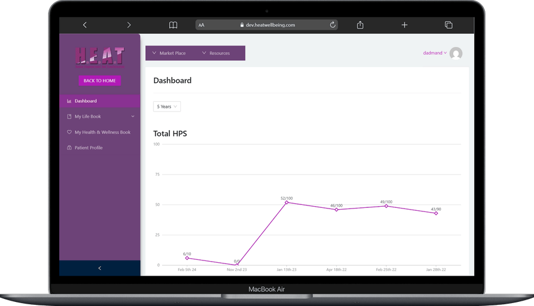

<h1 align="center">Hi, I'm MohammadReza Dadmand 👋</h1>
<h3 align="center">Fullstack AI Engineer — production-grade LLM platforms, RAG systems & agentic AI</h3>

  
  
  
  

---

## 🧠 About Me

- 🔭 **8+ years** shipping production fullstack systems — and for the last several, fusing them with **LLMs, RAG, and agentic AI** that actually work in production
- 🤖 I architect **multi-tenant RAG platforms** and **agentic AI frameworks** end to end — from vector store and orchestration layer to the React frontend — for teams in Australia, Canada, Finland, and the US
- ⚡ Typical stack I own solo: **Python/FastAPI + NestJS/Node.js backends, React/Next.js frontends, PostgreSQL, Docker, AWS**
- 🍕 Tech Solution Architect at **[code4pizza](https://code4pizza.com)** — a remote-first team of researchers and engineers
- 🎓 Ph.D. candidate in **Computer Architecture** — published in *The Journal of Supercomputing* (ISI, IF 3.3)

## 🛠️ Tech Stack

**AI / ML Engineering**

**Fullstack & Infrastructure**

  

## 🚀 Featured Work

| | |
|---|---|
| **🏢 Enterprise AI Virtual Assistant Platform** — multi-tenant RAG microservices with secure tenant isolation, configurable corporate knowledge bases, and session-aware memory via LangGraph. `Python` `FastAPI` `NestJS` `TypeScript` `ChromaDB` `Dify` | **✈️ AI Travel Assistant (Inspiral)** — agentic group-travel planner that joins chats, tracks multi-session user context in ChromaDB, and validates bookings against the Australian Tourism API (ATLAS, 10k+ venues). `LangGraph` `FastAPI` `Node.js` |
| **🏗️ ByLaw AI** — construction-permit assistant validating form data against the Canadian National Building Code in real time with engineered RAG pipelines (80%+ retrieval accuracy). Cut consultation turnaround from weeks to hours. `LLM` `RAG` `React` `FastAPI` | **🏥 Heat Academy** — fullstack health-education LMS on AWS App Runner: course management, progress tracking, certifications, plus a Chrome extension syncing with legacy OSCAR EMR systems. `React` `Node.js` `PostgreSQL` |

  
  

<b>🥽 Bonus: XR / 3D work — Unreal Engine 5, Unity, WebGL</b>

 

Photorealistic architectural visualization, AR applications, and realtime 3D on the web (Three.js / GLSL).

  
  

## 📖 Open Source & Research

- **[LawAdviser](https://github.com/cgraider/LawAdviser)** — legal-advisory assistant: OpenAI Assistants API + FastAPI + async SQLAlchemy/PostgreSQL, Dockerized
- **[AMBTAR](https://github.com/cgraider/AMBTAR)** — simulation code for my paper *Adaptive Multi-Beltway Thermal-Aware Routing for 3D NoC Systems*, **The Journal of Supercomputing** ([DOI: 10.1007/s11227-025-07580-5](https://doi.org/10.1007/s11227-025-07580-5))
- **[gem5-3d-noc-routing](https://github.com/cgraider/gem5-3d-noc-routing)** — gem5 fork for 3D NoC routing research (Garnet: DeepNR3D, XYZ, CAQR + RL pipeline)
- **[code4pizza-astro](https://github.com/cgraider/code4pizza-astro)** — the code4pizza.com site: Astro SSG + React + Tailwind

## 📊 GitHub Stats

  
  

---

<i>“From dependable digital foundations to AI that actually works.”</i> — <a href="https://code4pizza.com">code4pizza</a>

